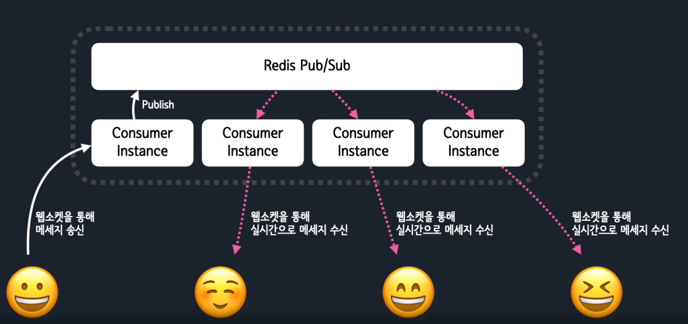

# django-channels-practice

Django Channels를 활용한 비동기 웹 애플리케이션 연습 레포지토리

## Overview

채팅 서비스의 핵심은 실시간 메세징

## 서버에서 웹 클라이언트로 메세지를 전달하려면?

### HTTP Polling (실시간 X)

- 서버로 일정주기로 요청/응답 반복(새로고침 연타)
- 구현 간단, 비효율적
- 반복된 HTTP 요청/응답 에서 요청/응답 패킷의 오버헤드가 큼.

### HTTP Long Polling

- 서버에 요청을보내고 응답을 받을때 까지 연결을 유지하며, 응답을 대기
- 연결이 끊어지거나 응답을 받으면 다시 요청
- 메세지가 많을 경우 풀링과 유사

### HTTP Streaming

- 서버에 요청을 보내고, 연결이 유지된 상태에서 데이터를 계속 수신
- 이벤트 목적보다 큰 크기의 응답을 해야할 때 유용
- 클라이언트에서 서버로의 전송 X

### Web Socket (실시간 O)

- 연결이 유지되는 동안, 양방향 통신 지원
- 클라이언트/서버 상호 간에 즉시성이 높은 데이터 전송
- HTTP와 동일한 포트(80/443) 사용
- 장고 채널스에서 지원

## Redis Pub/Sub

서버 단에서 채팅방의 다른 유저에게 메세지를 뿌리는 역할. 유저로의 전달은 웹소켓이 담당.

- 레디스 특정 채널에 구독신청을 하면 Subscriber가 됩니다. 레디스 특정 채널에 메세지를 Publish 하면, 구독 중인 구독자에게 메세지가 전달됩니다.
  - ex: 유튜브 구독
- 레디스의 Pub/Sub는 메세지를 "전달하는" 시스템이기에 메세지를 보관하지 않습니다.
  - 지난 채팅 메세지 조회 필요시 메세지를 DB에 넣고 조회
- 서버 대수를 늘려 Horizontal로 손쉬운 Scale out을 지원

## 메시지 흐름

채널스의 Consumer Instance는 레디스의 Pub/Sub과 유저와의 메세지 중개자 역할을 하며각 웹 소켓 연결마다 하나씩 생성합니다.
유저 A -송신-> Consumer Instance -송신-> Redis Pub/Sub -> 채팅방에 있는 다른 유저들의 Consumer Instance를 경유 -> 유저 B/C/D

## 웹 애플리케이션 서버 인터페이스: WSGI와 ASGI 소개

장고는 WSGI / ASGI 모두를 기본에서 잘 지원하며, 원하는 방식으로 구동

- 장고의 일반적인 뷰 처리는 (Django, DRSF 등) WSGI 방식이 성능이 더 잘 나올수도 있습니다.

### WSGI

Web Server Gateway Interface

- Synchronous 파이썬 HTTP 웹에 대한 파이썬 표준
- HTTP 요청/응답의 단일 처리만 가능한 방식, 웹소켓 지원 불가

### ASGI

Asynchronous Server Gateway Interface

- WSGI의 정신적 계승자
- HTTP 프로토콜 뿐만 아니라 웹소켓 등의 다양한 프로토콜을 지원할 수 있는 기반을 제공
- WSGI과의 호환성 지원과 더불어 Asynchronous / Synchronous 모두에 대한 파이썬 표준을 제공

## [Channels](https://github.com/django/channels)

- ASGI 기반의 라이브러리로써, HTTP/웹소켓 프로토콜을 손쉽게 처리할 수 있도록 기능 지원
  - 장고 네이티브한 방법으로 웹소켓 지원
- 파이썬 3.7 이상, 장고 2.2 이상을 지원

### 웹소켓 처리에 대한 완벽한 추상화 지원

연결수락/송신/수신/끊기
웹 소켓 처리 시에 특별한 세팅없이도, 모델/세션/쿠키/인증/캐시 템플릿 등의 장고의 모든기능을 사용할수 있습니다. 웹소켓에서 웹페이지와 동일하게 쿠키/세션을 모두 사용할 수 있습니다.

### 손쉬운 프로세스 간의 통신(채널레이어 레디스 백엔드를 활용)

- 코드 몇줄로 유저 A의 채팅 메세지를 다른 유저에게 전달토록(브로드캐스팅) 개발 가능!

### 채널과 그룹

#### 채널

- Consumer Instance 내부에서 생성
- 하나의 연결마다 Consumer 클래스의 Instance가 자동으로 생성되며, 각 Consumer Instance마다 고유한 채널명을 가집니다.
- 그 채널을 통해 Consumer Instance는 채널 레이어와 통신합니다.

#### 그룹

- 여러 Consumer Instance를 묶는 논리적인 묶음.
- 그룹명을 알면, 그 그룹에 속한 모든 Consumer Instances에게 메세지를 보낼 수 있습니다.
